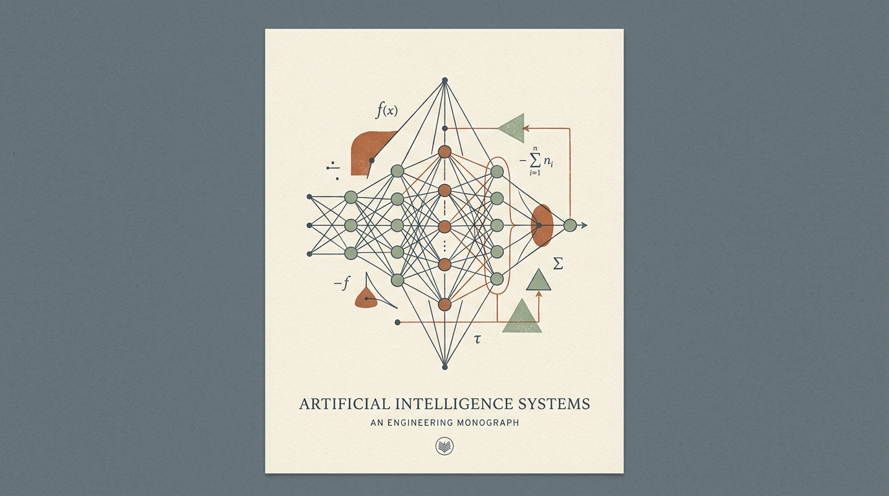

# AI Engineering from Scratch — Offline & Online Study Companion

<div align="center">



<br/>

**A local-first, distraction-free digital learning environment for mastering AI Engineering from first principles.**

[](https://vitejs.dev/)
[](https://react.dev/)
[](https://www.typescriptlang.org/)
[](https://groq.com/)
[](https://developer.mozilla.org/en-US/docs/Web/API/IndexedDB_API)
[-3776AB?style=flat-square&logo=python&logoColor=white)](https://pyodide.org/)
[](https://www.electronjs.org/)
[](./LICENSE)

[Features](#-key-features) • [Research Papers & Daily Gate](#-research-papers--daily-reading-gate) • [Multi-User Learning](#-multi-learner-profiles--isolated-progress) • [Curriculum Structure](#-curriculum-architecture) • [Getting Started](#-getting-started) • [Desktop App (.exe)](#-standalone-desktop-app-electron) • [Documentation](./SYSTEM_DOCS.md)

</div>

---

## 📖 Overview

The **AI Engineering Study Companion** is a local-first, privacy-respecting educational application built for deep self-paced study of the comprehensive 20-track **[AI Engineering from Scratch](https://github.com/rohitg00/ai-engineering-from-scratch)** curriculum (**523 structured chapters, 48 hands-on projects**).

Designed with the aesthetic rigor of an academic monograph (inspired by Stripe Press and MIT Press), it eliminates generic SaaS bloat and online distractions to provide a serene, focused reading, coding, and review environment — anchored by a **daily research paper reading habit** powered by Groq AI.

---

## ✨ Key Features

### 1. 📚 Research Papers & Daily Reading Habit *(v1.2.0 — NEW)*

> **Explore 4–5 seminal AI papers daily to connect foundational research with production code.**

- **12 curated seminal papers** bundled offline — from *Attention Is All You Need* to *vLLM PagedAttention* to the *Model Context Protocol*.
- **100% Offline-Ready & Non-Blocking** — lessons remain freely accessible anytime with or without reading, giving complete flexibility for offline study.
- **Groq AI Deep-Dive** — when online, click any paper to get an instant Groq LLaMA-3.3-70B analysis covering: *why it matters*, *core contribution*, *engineering implications*, *limitations*, and *discussion questions*.
- **AI Trends Feed** — a 6-item AI engineering trend briefing generated fresh by Groq each session.
- **Daily habit tracking** — visual daily progress ring and streak tracker for completing 4 papers a day.
- **Full paper library** — all 12 papers always accessible by category (Foundations, Transformers & LLMs, Agents & MCP, Inference & Systems, Frontier Evals).

| Paper | Category | Phase |
|:---|:---|:---|
| Attention Is All You Need | Transformers & LLMs | Phase 07 |
| GPT-3: Language Models are Few-Shot Learners | Transformers & LLMs | Phase 09 |
| InstructGPT (RLHF) | Transformers & LLMs | Phase 11 |
| Retrieval-Augmented Generation (RAG) | Agents & MCP | Phase 14 |
| ReAct: Reasoning & Acting | Agents & MCP | Phase 13 |
| Chain-of-Thought Prompting | Transformers & LLMs | Phase 10 |
| LoRA: Low-Rank Adaptation | Inference & Systems | Phase 11/17 |
| Model Context Protocol (MCP) | Agents & MCP | Phase 13 |
| FlashAttention | Inference & Systems | Phase 07/18 |
| PagedAttention / vLLM | Inference & Systems | Phase 18 |
| Scaling Laws (Kaplan et al.) | Foundations | Phase 09 |
| GPT-4 Technical Report | Frontier Evals | Phase 19 |

### 2. 👥 Multi-Learner Profiles & Isolated Progress (Online & Local)
* **Individual Progress Isolation**: One person's study progress, notes, quiz attempts, and review decks never mix with another's.
* **Instant Profile Switcher**: Switch between learners in one click right from the top navigation bar.
* **Optional PIN Security**: Protect your private notes and study session data with an encrypted 4+ digit PIN.
* **Zero Backend Requirement**: Accounts operate 100% locally with client-side SHA-256 hashing and dedicated IndexedDB storage spaces per user.

### 3. 📴 100% Offline & Local-First (except Groq AI calls)
* **Zero Runtime API Calls for Lessons**: All 523 lessons, code files, and quiz assets are pre-compiled at build time into static JSON chunks.
* **Durable IndexedDB Persistence**: All notes, chapter completions, quiz attempts, study streaks, and spaced repetition intervals persist locally.
* **Groq AI** is the only network dependency — and only when you click "AI Deep-Dive" or "Refresh Trends".

### 4. 🗺️ 5 Connected Learning Milestones
The 20 curriculum tracks are organized into 5 progressive milestones:

<div align="center">

| Milestone | Focus & Capabilities | Curriculum Coverage |
|:---|:---|:---:|
| **01. Foundations & Core ML** | Setup, Calculus, Linear Algebra, Optimization, Classic ML, Deep Learning | `Tracks 00–03` |
| **02. Perceptual Modalities** | Computer Vision, NLP Tokenization & Embeddings, Speech Spectrograms | `Tracks 04–06` |
| **03. Generative Models & Transformers** | Multi-Head Attention, Diffusion, RLHF, LLMs from Scratch | `Tracks 07–11` |
| **04. Agentic Systems & Autonomy** | MCP, Multimodal RAG, ReAct Loops, Multi-Agent Swarms | `Tracks 12–16` |
| **05. Production & Capstones** | vLLM Inference, Quantization, Alignment Ethics, Capstones | `Tracks 17–19` |

</div>

### 5. 🔨 48 Hands-On Projects
* Projects track with **48 real-world builds** — tiny coding agents, RAG pipelines, transformer implementations, vLLM serving clusters.
* Each project has multi-stage milestones, starter code, test files, and a demo command.
* Track your project status (Not Started / In Progress / Completed) with personal notes and repo URL.

### 6. 🏆 Certifications Prep
* **MCPA (Model Context Protocol Associate)** exam preparation track.
* Exam blueprints, domain weightings, lesson mappings, and exam facts.
* **Claude AI Certification** track.

### 7. 🧠 SuperMemo-2 (SM-2) Spaced Repetition
* Missed quiz questions are automatically scheduled in your personal **Review Deck**.
* SM-2 algorithm calculates optimal review intervals based on *Forgot / Hard / Good / Easy* ratings.

### 8. 🐍 In-Browser Python Execution (Pyodide WebAssembly)
* **Zero Local Python Setup**: Execute Python examples directly in your browser.
* **Live Terminal Output Console**: Captures stdout, stderr, execution time, and structured error diagnostics.

### 9. 👓 Reading Comfort, Focus Mode & Bookmarks
* **Single-Key Focus Mode**: Press **`F`** to collapse navigation and immerse in distraction-free reading.
* **Typography Preferences**: Book Serif or Clean Sans, `S` to `XL` font size, column width adjustment.
* **Chapter Bookmarking**: Save chapters for one-click reference.

### 10. 💾 Full Data Backup & Portability
* **One-Click JSON Export**: Download your complete study history, notes, quiz scores, and SM-2 flashcard intervals.
* **Seamless Restore**: Move study progress between devices without accounts or cloud servers.

---

## 🏗️ Curriculum Architecture

```
523 lessons × 20 phases × 5 milestones
       +
48 hands-on projects (5 difficulty levels)
       +
Certifications (MCPA + Claude AI)
       +
Career Learning Paths (role-based routes)
       +
12 seminal research papers (bundled)
```

---

## 🚀 Getting Started

### Prerequisites
- Node.js ≥ 18
- npm ≥ 9

### 1. Clone (with curriculum submodule)
```bash
git clone --recurse-submodules https://github.com/Edward-Oppong/ai-engineering.git
cd ai-engineering
npm install
```

### 2. Index the curriculum (generates JSON from `.md` files)
```bash
npm run build:data
```

### 3. Start the dev server
```bash
npm run dev
```

Open `http://localhost:5173` — navigate to **Research** tab and read 4 papers to unlock your first lesson.

---

## 🖥️ Standalone Desktop App (Electron)

Build a standalone Windows installer:

```bash
npm run electron:build
```

Output (in `release/` directory):
- `AI Engineering Study Companion Setup.exe` — full installer (NSIS)
- `AI Engineering Study Companion Portable.exe` — no-install portable binary

Both include the full curriculum, research paper library, and Groq AI integration.

---

## 🔐 Security & Privacy Architecture

| Data | Where Stored | Who Sees It |
|---|---|---|
| Lesson progress & notes | Browser IndexedDB (device-local) | Only on your device |
| Profile credentials (PIN) | localStorage (SHA-256 hashed) | Never transmitted |
| Daily reading progress | localStorage (date-keyed) | Only on your device |
| Quiz & review data | Browser IndexedDB (device-local) | Only on your device |
| Paper analysis requests | Groq Cloud API (when clicked) | Paper abstract + Groq |
| AI trend requests | Groq Cloud API (when clicked) | Prompt only, no user data |

> The Groq API key is embedded in the frontend bundle for local/Electron use.  
> For a public deployment, proxy it through a lightweight BFF (e.g., Vercel Edge Function).

---

## 📄 System Documentation

See **[SYSTEM_DOCS.md](./SYSTEM_DOCS.md)** for the complete technical reference:
- Full architecture diagram
- IndexedDB schema (v3)
- Daily reading gate implementation details
- Groq API integration notes
- Build pipeline walkthrough
- Component & view reference tables
- Troubleshooting guide

---

## 📜 License

MIT — see [LICENSE](./LICENSE)