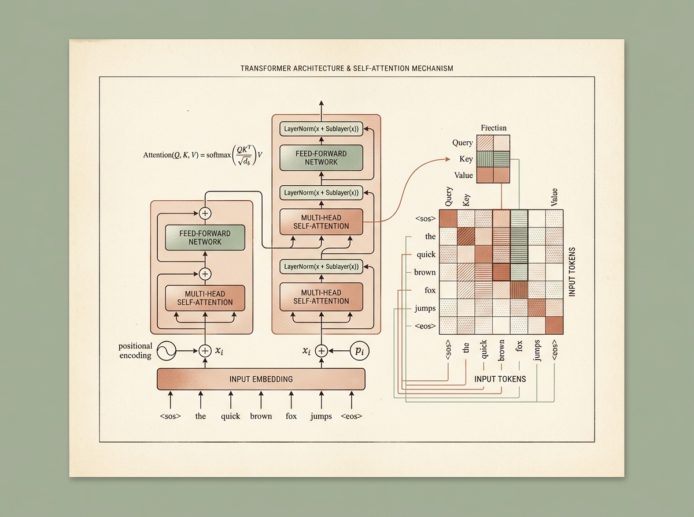
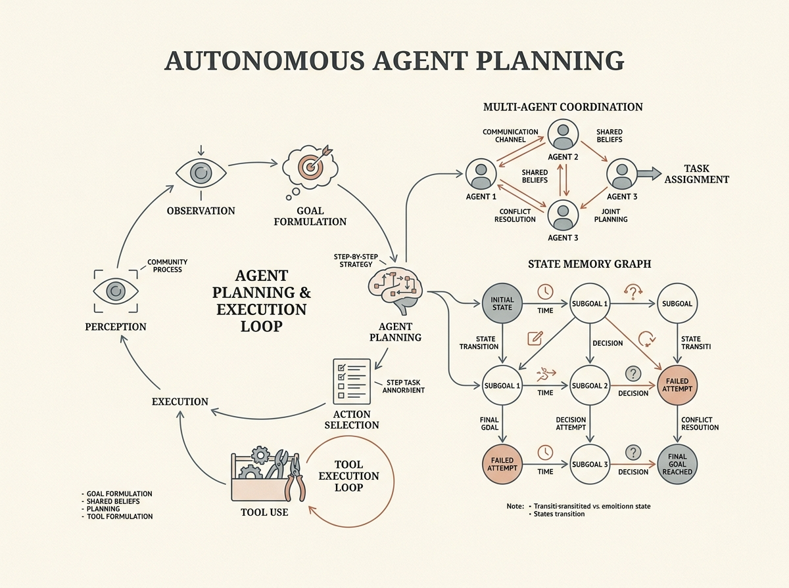

# AI Engineering from Scratch — Offline Study Companion

<div align="center">


<br/>

**A local-first, distraction-free digital learning environment for mastering AI Engineering from first principles.**

[](https://vitejs.dev/)
[](https://react.dev/)
[](https://www.typescriptlang.org/)
[](https://developer.mozilla.org/en-US/docs/Web/API/IndexedDB_API)
[-3776AB?style=flat-square&logo=python&logoColor=white)](https://pyodide.org/)
[](./LICENSE)

[Features](#-key-features) • [Curriculum Structure](#-curriculum-architecture) • [Getting Started](#-getting-started) • [Python in Browser](#-in-browser-python-execution) • [Security & Privacy](#-security--privacy-architecture) • [Documentation](#-system-documentation)

</div>

---

## 📖 Overview

The **AI Engineering Study Companion** is a local-first, privacy-respecting educational web application built for deep self-paced study of the 20-track **[AI Engineering from Scratch](https://github.com/rohitg00/ai-engineering-from-scratch)** curriculum (503 structured chapters).

Designed with the aesthetic rigor of an academic monograph (inspired by Stripe Press and MIT Press), it eliminates generic SaaS bloat and online distractions to provide a serene, focused reading, coding, and review environment.

---

## ✨ Key Features

### 1. 📴 100% Offline & Local-First
* **Zero Runtime API Calls**: All 503 lessons, code files, and quiz assets are pre-compiled at build time into static JSON chunks.
* **Durable IndexedDB Persistence**: All notes, chapter completions, quiz attempts, study streaks, and spaced repetition intervals persist locally in your browser's IndexedDB.

### 2. 🗺️ 5 Connected Learning Milestones

The 20 curriculum tracks are organized into 5 progressive milestones with rich domain color-coding and architectural lithographs:

<div align="center">

| Milestone | Focus & Capabilities | Art |
|:---|:---|:---:|
| **01. Foundations & Core ML** | Setup, Calculus, Linear Algebra, Optimization, Classic ML, Deep Learning Tensor Core | `Tracks 00–03` |
| **02. Perceptual Modalities** | Computer Vision Convolutions, NLP Tokenization & Embeddings, Speech Spectrograms | `Tracks 04–06` |
| **03. Generative Models & Transformers** | Multi-Head Attention, Diffusion Mathematics, RLHF, and LLMs from Scratch |  |
| **04. Agentic Systems & Autonomy** | Tool Protocols (MCP), Multimodal RAG, Autonomous ReAct Loops, Multi-Agent Swarms |  |
| **05. Production & Capstones** | Distributed vLLM Inference, Quantization, Alignment Ethics, and Production Capstones | `Tracks 17–19` |

</div>

---

### 3. 🧠 SuperMemo-2 (SM-2) Spaced Repetition
* **Automated Retention Deck**: Questions missed during chapter quizzes are automatically scheduled in your **Review Deck**.
* **Scientifically Optimized**: Implements the SuperMemo-2 algorithm to calculate optimal review intervals based on your self-reported recall difficulty (*Forgot / Hard / Good / Easy*).

---

### 4. 🐍 In-Browser Python Execution (Pyodide WebAssembly)
* **Zero Local Python Setup**: Execute Python code examples directly in your browser using Pyodide (Python compiled to WebAssembly).
* **Live Terminal Output Console**: Captures real-time `stdout`, `stderr`, execution time in milliseconds, and structured error diagnostics in a sandboxed runtime.

---

### 5. 👓 Reading Comfort, Focus Mode & Bookmarks
* **Single-Key Focus Mode**: Press **`F`** to collapse all navigation bars and immerse yourself in distraction-free reading. Press **`Esc`** or **`F`** to exit.
* **Typography Preferences**: Choose between **Book Serif** (`Charter` / `Newsreader`) and **Clean Sans** (`Inter`), customize font size (`S` to `XL`), and adjust reading column width.
* **Chapter Bookmarking**: Save chapters for one-click reference.

---

### 6. 💾 Full Data Backup & Portability
* **One-Click JSON Export**: Download your complete study history, personal notes, quiz scores, and SM-2 flashcard intervals as a single `.json` file.
* **Seamless Restore**: Move your study progress between devices without requiring accounts or cloud servers.

---

## 🚀 Getting Started

### Prerequisites
* **Node.js** 18+ installed on your computer
* **npm** (comes with Node.js)

### Installation & Local Run

#### Using Bash (macOS / Linux / Git Bash)
```bash
# 1. Clone the repository
git clone https://github.com/Edward-Oppong/ai-engineering.git
cd ai-engineering

# 2. Install dependencies
npm install

# 3. Compile curriculum data index
npm run build:data

# 4. Start local development server
npm run dev
```

#### Using PowerShell (Windows)
```powershell
# 1. Clone the repository
git clone https://github.com/Edward-Oppong/ai-engineering.git
cd ai-engineering

# 2. Install dependencies
npm install

# 3. Compile curriculum data index
npm run build:data

# 4. Start local development server
npm run dev
```

The app will start at `http://localhost:5173`.

---

## 🏗️ Production Build & Desktop App (.exe)

### 1. Web Production Build
```bash
# Compile curriculum index, TypeScript, and Vite static assets
npm run build

# Preview static build locally
npm run preview
```

### 2. Standalone Desktop App (Electron)
You can package the entire application into a standalone desktop `.exe` installer or portable binary:

```bash
# Run the desktop app locally
npm run electron:start

# Package into a native Windows .exe (installer + portable executable)
npm run electron:build
```
The packaged installers will be generated inside the `release/` directory:
* **Installer**: `release/AI Engineering Study Companion Setup 1.0.0.exe`
* **Portable**: `release/AI Engineering Study Companion 1.0.0.exe`

---

## 🧪 Testing

Run the automated test suite covering the SM-2 spaced repetition algorithm and data calculation edge cases:

```bash
npm run test
```

---

## 🛡️ Security & Privacy Architecture

| Security Area | Implementation & Guarantee |
|---|---|
| **Attack Surface** | **Zero Backend** — No open ports, no remote database, zero exposed API credentials. |
| **Python Sandbox** | **WebAssembly Isolated** — Pyodide executes strictly within the browser tab sandbox with zero host filesystem access. |
| **Content Security** | **Strict SVG & Markdown** — Mermaid diagrams run under `securityLevel: 'strict'`; Markdown is parsed into an AST without raw HTML evaluation. |
| **Data Privacy** | **100% Client-Side** — Zero telemetry, zero tracking cookies, zero analytics scripts. Your study data never leaves your computer. |

---

## 📚 System Documentation

For detailed architectural schematics, IndexedDB table structures, failure modes, and recovery procedures, refer to **[SYSTEM_DOCS.md](./SYSTEM_DOCS.md)**.

---

## 📄 License & Attribution

* **Curriculum Content**: Based on the [AI Engineering from Scratch](https://github.com/rohitg00/ai-engineering-from-scratch) curriculum by Rohit G.
* **Study Platform Source Code**: MIT License.