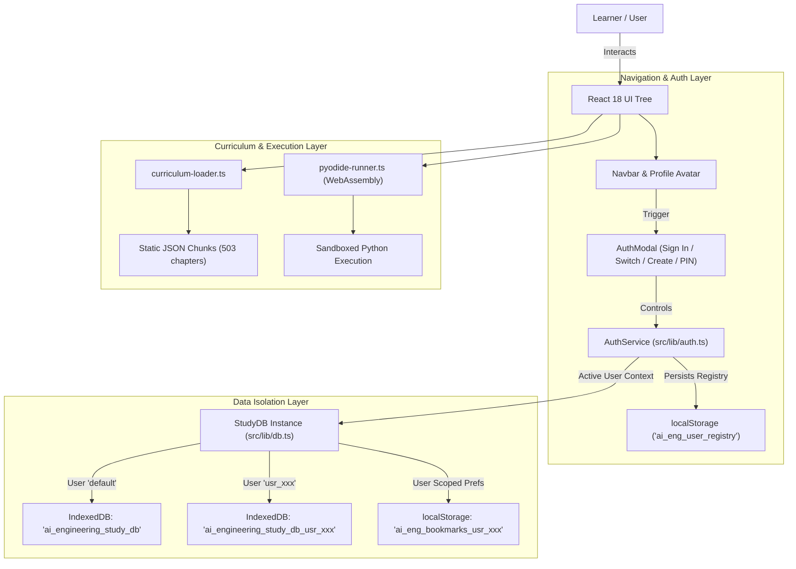

# AI Engineering Study Companion — System Documentation

> **Living Document** — Update this file whenever any source file is modified.  
> Last Updated: 2026-08-21  
> Version: 1.1.0  

---

## Table of Contents

1. [Project Overview](#1-project-overview)
2. [Technology Stack](#2-technology-stack)
3. [Directory Structure](#3-directory-structure)
4. [System Architecture](#4-system-architecture)
5. [Multi-Learner Profiles & Progress Isolation](#5-multi-learner-profiles--progress-isolation)
6. [Build Pipeline](#6-build-pipeline)
7. [Data Layer](#7-data-layer)
8. [IndexedDB Schema](#8-indexeddb-schema)
9. [Spaced Repetition Engine (SM-2)](#9-spaced-repetition-engine-sm-2)
10. [In-Browser Python Execution (Pyodide)](#10-in-browser-python-execution-pyodide)
11. [Design System](#11-design-system)
12. [Component Reference](#12-component-reference)
13. [View Reference](#13-view-reference)
14. [Known Thresholds & Risk Areas](#14-known-thresholds--risk-areas)
15. [What Could Crash & How to Recover](#15-what-could-crash--how-to-recover)
16. [Development Workflow](#16-development-workflow)
17. [File Change Log](#17-file-change-log)

---

## 1. Project Overview

A **local-first, multi-learner web and desktop application** for self-paced study of the [AI Engineering from Scratch](https://github.com/rohitg00/ai-engineering-from-scratch) curriculum (**503 chapters across 20 tracks**).

### Core Principles
- **Zero runtime network calls** — everything works with Wi-Fi disconnected.
- **Isolated per-learner persistence** — individual progress, chapter notes, quiz attempts, study streaks, and spaced repetition decks are completely isolated per user account.
- **Durable browser IndexedDB** — resilient, queryable, survives page refreshes and browser restarts.
- **Static deployment** — a single `dist/` folder, deployable on Vercel, GitHub Pages, Netlify, or as a standalone Windows desktop executable (`.exe`).
- **503 lessons across 20 phases** indexed at build time into static JSON chunks, never fetched dynamically at runtime.

### Feature Matrix
| Feature | Implementation | Multi-Learner Isolation |
|---|---|---|
| Read lessons | Markdown rendered client-side via `react-markdown` | Shared static assets |
| Track progress | IndexedDB `lessons` store, per-lesson status | Isolated per `userId` DB |
| Take notes | Auto-saved per-lesson to IndexedDB | Isolated per `userId` DB |
| Knowledge checks | Multiple-choice quiz per lesson | Isolated per `userId` DB |
| Spaced repetition | Missed quiz questions scheduled via SM-2 algorithm | Isolated per `userId` DB |
| In-browser Python | Sandboxed Pyodide WebAssembly execution with console | Client-side sandbox |
| Multi-user login | Client-side profile switcher + SHA-256 PIN security | User registry & DB routing |
| Offline search | `fuse.js` fuzzy search over all 503 lesson summaries | Shared static index |
| Diagrams & Code | Mermaid diagrams & `prism-react-renderer` syntax highlighting | Local offline render |
| Desktop App | Standalone Electron binary for Windows (`.exe`) | Local storage & IDB |

---

## 2. Technology Stack

| Layer | Technology | Version | Purpose |
|---|---|---|---|
| Framework | React | ^18.3.1 | UI component tree |
| Language | TypeScript | ^5.7.3 | Type safety across data and UI |
| Bundler | Vite | ^6.1.0 | Dev server, production build, code splitting |
| Desktop Shell | Electron & electron-builder | ^34.2.0 / ^25.1.8 | Standalone Windows `.exe` packaging |
| Styling | Tailwind CSS | ^3.4.17 | Utility classes and layout |
| CSS | Vanilla CSS (`index.css`) | — | Design tokens, typography, custom scrollbars |
| Fonts | Inter, Newsreader | — | Typographic system |
| Markdown | react-markdown + remark-gfm | ^9.0.3 / ^4.0.0 | Render chapter `.md` files |
| Diagrams | Mermaid | ^11.4.1 | Render architecture diagrams offline |
| Code highlight | prism-react-renderer | ^2.4.1 | Syntax highlighting, VS Dark theme |
| Python Runtime | Pyodide (WebAssembly) | CDN/WASM | In-browser Python code execution |
| Icons | lucide-react | ^1.16.0 | All UI icons |
| Search | fuse.js | ^7.1.0 | Client-side fuzzy search |
| Storage | Native IndexedDB | Browser API | Multi-database durable local data |
| Test Suite | Vitest | ^4.1.11 | Automated SM-2 and persistence testing |

---

## 3. Directory Structure

```
Ai_engineering/
│
├── curriculum/                        # Source curriculum files (NOT bundled directly)
│   ├── ROADMAP.md                     # Master phase/lesson metadata
│   └── phases/
│       └── <phase-folder>/
│           └── <lesson-folder>/
│               ├── docs/en.md         # Lesson markdown content
│               ├── code/              # Runnable code examples
│               └── quiz.json          # Quiz questions (optional)
│
├── scripts/
│   └── index-curriculum.mjs           # BUILD-TIME ONLY: scans curriculum/ → writes src/data/
│
├── electron/
│   ├── main.cjs                       # Electron main process entry point
│   └── preload.cjs                    # Context isolation preload script
│
├── public/
│   ├── illustrations/                 # Academic monograph lithographs
│   │   ├── monograph-cover.jpg
│   │   ├── transformers.jpg
│   │   └── agents.jpg
│   └── favicon.ico
│
├── src/
│   ├── main.tsx                       # React entry point
│   ├── App.tsx                        # Root: routing, multi-user auth sync, dark mode
│   ├── index.css                      # Global styles, CSS tokens, monograph typography
│   ├── vite-env.d.ts                  # Vite type declarations
│   │
│   ├── data/                          # GENERATED at build time — do NOT edit manually
│   │   ├── roadmap.json               # 20 phases metadata array
│   │   ├── lessons-summary.json       # All 503 lesson summaries
│   │   └── phases/
│   │       ├── phase-00.json          # Full detail for Phase 0
│   │       └── phase-19.json
│   │
│   ├── types/
│   │   └── index.ts                   # ALL TypeScript interfaces and types
│   │
│   ├── lib/
│   │   ├── auth.ts                    # User profile management & SHA-256 PIN hashing
│   │   ├── db.ts                      # Multi-user IndexedDB access layer (StudyDB)
│   │   ├── sm2.ts                     # SuperMemo-2 spaced repetition algorithm
│   │   ├── pyodide-runner.ts          # WebAssembly Python sandbox runner
│   │   └── curriculum-loader.ts       # Lazy phase chunk loader + in-memory cache
│   │
│   ├── components/
│   │   ├── Navbar.tsx                 # Top navigation bar + user profile avatar chip
│   │   ├── AuthModal.tsx              # Sign in, profile switch, registration & PIN security
│   │   ├── SettingsModal.tsx          # User stats, active profile card & JSON backup
│   │   ├── SearchModal.tsx            # Ctrl+K offline fuzzy search modal
│   │   ├── ReadingControls.tsx        # Floating typography & Focus Mode toolbar
│   │   ├── MarkdownRenderer.tsx       # Lesson markdown + Mermaid + copy code
│   │   ├── CodeViewer.tsx             # Multi-file source code browser + Python runner
│   │   ├── QuizView.tsx               # Knowledge check quiz runner + SM-2 scheduler
│   │   ├── ErrorBoundary.tsx          # Component tree crash recovery
│   │   └── StorageWarningBanner.tsx   # Alert banner when IDB is unavailable
│   │
│   └── views/
│       ├── DashboardView.tsx          # Study Overview: Milestones, Streaks, Review Deck
│       ├── PhasesView.tsx             # Syllabus: 20 tracks grouped by 5 milestones
│       ├── LessonView.tsx             # Chapter reader: Markdown, Code viewer, Quiz
│       └── ReviewQueueView.tsx        # Spaced repetition flashcard deck runner
│
├── tests/
│   └── sm2.test.ts                    # Automated tests for SM-2 repetition calculations
│
├── README.md                          # Project overview and user guide
├── SYSTEM_DOCS.md                     # System architecture and technical documentation
├── package.json
└── vite.config.ts
```

---

## 4. System Architecture



---

## 5. Multi-Learner Profiles & Progress Isolation

### 5.1 Architecture & Design
To allow multiple people to learn on the same shared computer or online web deployment without interfering with each other's progress:
1. **User Registry**: Stored in `localStorage` under `ai_eng_user_registry`. Each profile contains `id`, `name`, `username`, `email` (optional), `avatarColor`, `createdAt`, `lastLoginAt`, and optional `pinHash`.
2. **Backward Compatibility**: On first run or upgrade from v1.0, a default profile (`id: 'default'`, name: `'Learner'`) is automatically provisioned, maintaining access to all existing progress stored in `ai_engineering_study_db`.
3. **Database Scoping**:
   - For `default`, DB name is `ai_engineering_study_db`.
   - For any other learner (`usr_12345`), DB name is `ai_engineering_study_db_usr_12345`.
4. **Dynamic Context Switch**: When a learner switches profiles via `AuthModal`:
   - Any open IndexedDB connection is cleanly closed.
   - `StudyDB.switchUser(userId)` is invoked.
   - React state resets and re-queries the new user's isolated tables, loading their specific chapter completions, notes, quiz scores, SM-2 flashcard intervals, bookmarks, and streaks.

### 5.2 PIN Protection
Learners can optionally protect their profile with a 4+ digit PIN:
- The PIN is hashed client-side using `crypto.subtle.digest('SHA-256', ...)` with a local salt.
- Plaintext PINs are never persisted.
- Switching to a PIN-protected profile prompts for PIN verification before opening the database.

---

## 6. Build Pipeline

```
curriculum/
   ├── ROADMAP.md
   └── phases/phase-XX/lesson-YY/
            ├── docs/en.md
            ├── code/*
            └── quiz.json
                  │
                  ▼
         [scripts/index-curriculum.mjs]
                  │
   ┌──────────────┴──────────────┐
   ▼                             ▼
src/data/roadmap.json   src/data/phases/phase-XX.json
src/data/lessons-summary.json
```

1. **Step 1 (`npm run build:data`)**: `scripts/index-curriculum.mjs` parses markdown and code into lightweight JSON chunks.
2. **Step 2 (`tsc -b`)**: TypeScript compiler validates all types.
3. **Step 3 (`vite build`)**: Bundles static assets into `dist/`.
4. **Step 4 (`electron-builder`)**: Packages `dist/` into a native standalone Windows `.exe`.

---

## 7. Data Layer

### User Data Backup Format (`UserDataBackup`)
Exported and imported as a single JSON object:
```json
{
  "version": 1,
  "appName": "ai-engineering-study-companion",
  "exportedAt": "2026-08-21T16:00:00.000Z",
  "data": {
    "lessons": [
      {
        "id": "phase-00-lesson-01",
        "phaseId": "phase-00",
        "title": "Environment Setup",
        "slug": "environment-setup",
        "status": "completed",
        "notes": "Configured virtual environment with uv.",
        "completedAt": "2026-08-21T16:00:00.000Z"
      }
    ],
    "quizAttempts": [],
    "reviewQueue": [],
    "activityLog": [],
    "bookmarks": ["phase-00-lesson-01"],
    "readingPreferences": {
      "fontSize": "base",
      "fontFamily": "serif",
      "columnWidth": "standard",
      "focusMode": false
    }
  }
}
```

---

## 8. IndexedDB Schema

Each user profile has its own dedicated database (`ai_engineering_study_db` or `ai_engineering_study_db_<userId>`) with schema version `2`:

### Stores & Indexes
1. **`lessons`** (Key: `id`)
   - `phaseId` (index)
   - `status` (index: `'not_started' | 'in_progress' | 'completed'`)
   - `completedAt` (index)
2. **`quizAttempts`** (Key: `id`)
   - `lessonId` (index)
   - `answeredAt` (index)
3. **`reviewQueue`** (Key: `id`)
   - `dueDate` (index: `YYYY-MM-DD`)
   - `lessonId` (index)
   - `questionId` (index)
4. **`activityLog`** (Key: `date`)
   - Stores daily activity count for streaks.
5. **`bookmarks`** (Key: `lessonId`)
   - Stores bookmarked chapters.

---

## 9. Spaced Repetition Engine (SM-2)

Implements the SuperMemo-2 algorithm:
- When a quiz question is answered incorrectly, it enters the user's `reviewQueue`.
- Quality ratings:
  - `0–1`: Forgot (Interval reset to 1 day, repetition count reset)
  - `2`: Hard (Interval scaled, ease factor reduced)
  - `3`: Good (Standard SM-2 progression)
  - `4–5`: Easy (Bonus ease factor adjustment)

---

## 10. In-Browser Python Execution (Pyodide)

- **Sandbox**: Executes Python 3 code in WebAssembly without needing a Python installation on the user's computer.
- **Output Streaming**: Intercepts `sys.stdout` and `sys.stderr` to stream outputs live to `CodeViewer.tsx`.
- **Execution Diagnostics**: Measures runtime in milliseconds and formats execution errors cleanly.

---

## 11. Design System

- **Monograph Aesthetic**: Inspired by academic presses (MIT Press, Stripe Press).
- **Color Palette**:
  - Background (Light): Warm Paper `#f5f2eb` / Surface `#faf8f4`
  - Background (Dark): Warm Charcoal `#1c1b1a` / Surface `#242321`
  - Accent: Warm Amber & Stone
- **Typography**: Newsreader (Serif) & Inter (Sans).
- **Focus Mode**: Activated via **`F`** key, collapses navigation chrome.

---

## 12. Component Reference

| Component | Path | Description |
|---|---|---|
| `Navbar` | `src/components/Navbar.tsx` | Top navigation, search trigger, streak counter, theme toggle, and learner profile chip |
| `AuthModal` | `src/components/AuthModal.tsx` | Account switcher, learner registration, profile editor, and PIN security modal |
| `SettingsModal` | `src/components/SettingsModal.tsx` | Database statistics, active profile info, JSON export/restore, and reset actions |
| `SearchModal` | `src/components/SearchModal.tsx` | Offline fuzzy search dialog (Ctrl+K) with milestone metadata |
| `ReadingControls` | `src/components/ReadingControls.tsx` | Floating reading options: font size, font family, column width, and Focus Mode |
| `MarkdownRenderer` | `src/components/MarkdownRenderer.tsx` | Client-side markdown AST renderer with offline Mermaid support |
| `CodeViewer` | `src/components/CodeViewer.tsx` | Multi-file code browser with in-browser Python execution |
| `QuizView` | `src/components/QuizView.tsx` | Knowledge check runner with automatic SM-2 flashcard scheduling |
| `ErrorBoundary` | `src/components/ErrorBoundary.tsx` | React error boundary preventing UI crashes |
| `StorageWarningBanner` | `src/components/StorageWarningBanner.tsx` | Alert banner when IndexedDB is blocked |

---

## 13. View Reference

| View | Path | Description |
|---|---|---|
| `DashboardView` | `src/views/DashboardView.tsx` | Study overview, 5 connected milestones, review deck trigger, recent activity |
| `PhasesView` | `src/views/PhasesView.tsx` | Master curriculum syllabus (20 tracks across 5 milestones) |
| `LessonView` | `src/views/LessonView.tsx` | Chapter reader with reading controls, notes, practice code, and quizzes |
| `ReviewQueueView` | `src/views/ReviewQueueView.tsx` | Spaced repetition study deck runner |

---

## 14. Known Thresholds & Risk Areas

| Area | Limit / Risk | Mitigation |
|---|---|---|
| Notes Size | Very large text | Auto-capped and debounced saves (800ms) |
| Multi-tab DB Conflict | Concurrent writes | Readwrite transactions scoped per operation |
| Safari Private Browsing | IndexedDB blocked | `StorageWarningBanner` displays graceful warning |
| User DB Deletion | Accidental data loss | Confirmation required; minimum 1 user profile enforced |

---

## 15. What Could Crash & How to Recover

1. **Corrupted User Database**:
   - Open **Settings** → **Reset Database** for that specific learner profile, or restore from a previous JSON backup.
2. **Forgotten Profile PIN**:
   - In `localStorage`, inspect `ai_eng_user_registry` and remove `pinHash` for that user object, or delete that user profile and recreate it.
3. **Pyodide WASM Load Error**:
   - If offline when Pyodide first initializes, code execution will display an offline notice while reading and quizzes continue working normally.

---

## 16. Development Workflow

### Start Development Server
```bash
npm run dev
# App at http://localhost:5173
```

### Run Tests
```bash
npm run test
```

### Type Check
```bash
npx tsc --noEmit
```

### Package Desktop App
```bash
npm run electron:build
# Generates release/AI Engineering Study Companion 1.1.0.exe
```

---

## 17. File Change Log

| Date | File | Change |
|---|---|---|
| 2026-08-21 | `src/types/index.ts` | Added `UserProfile` and `AuthSession` interfaces for multi-learner profile system. |
| 2026-08-21 | `src/lib/auth.ts` | Created `AuthService` with user registry, SHA-256 PIN hashing, profile creation, switching, and deletion. |
| 2026-08-21 | `src/lib/db.ts` | Upgraded `StudyDB` to support dynamic user-scoped IndexedDB databases (`ai_engineering_study_db_<userId>`) and isolated localStorage keys. |
| 2026-08-21 | `src/components/AuthModal.tsx` | Created multi-learner authentication and profile management modal with PIN unlock, avatar picker, and registration. |
| 2026-08-21 | `src/components/Navbar.tsx` | Added user profile avatar chip and quick switcher trigger to navbar. |
| 2026-08-21 | `src/components/SettingsModal.tsx` | Added active learner profile card with direct switch button and isolated backup export. |
| 2026-08-21 | `src/App.tsx` | Integrated auth state, active user sync, and dynamic re-rendering on profile change. |
| 2026-08-21 | `README.md` | Comprehensive update covering Multi-Learner profiles, online learning, isolated progress, and Electron v1.1.0. |
| 2026-08-21 | `SYSTEM_DOCS.md` | Comprehensive system documentation update for v1.1.0 architecture, multi-user isolation, and data layers. |
